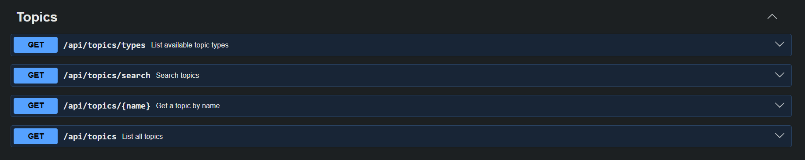
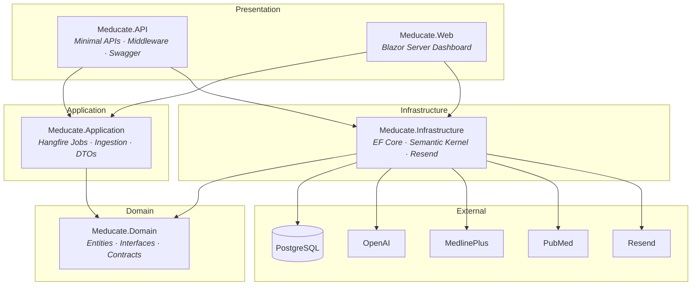
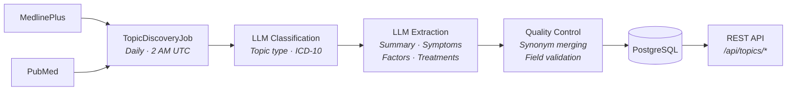

# MeducateAPI

**A medical education API that transforms raw health data into structured, searchable knowledge.**




## What It Does

MeducateAPI automatically discovers and aggregates medical topics from authoritative sources like MedlinePlus and PubMed, then uses LLM processing to extract structured data — summaries, symptoms, risk factors, and treatments — all classified under ICD-10 medical categories. The result is a clean REST API that developers can use to build health education tools without wrangling raw medical data themselves.

## Live

- **Web Dashboard** — [meducateapi.com](https://meducateapi.com)
- **REST API** — [api.meducateapi.com](https://api.meducateapi.com)

## Key Features

- **Magic-link authentication** — passwordless email sign-in with cookie-based sessions
- **API key management** — create, rename, and revoke keys per organisation (max 5 active)
- **Rate limiting** — two-tier system: 60 req/min per key + configurable daily limits with 80% usage alerts
- **Automated topic discovery** — daily Hangfire jobs fetch new topics from MedlinePlus at 2 AM UTC
- **Automated topic refresh** — existing topics re-processed daily at 3 AM UTC for accuracy
- **ICD-10 classification** — LLM-powered categorisation into 24 standardised medical categories
- **Interactive Swagger docs** — full OpenAPI spec with try-it-out support
- **Usage dashboard** — Blazor Server UI for managing keys, viewing usage, and browsing docs

## Architecture



The project follows **Clean Architecture** with four layers, each depending only inward:

| Layer | Project | Responsibility |
|---|---|---|
| **Domain** | `Meducate.Domain` | Entities, repository interfaces, service contracts — zero external dependencies |
| **Application** | `Meducate.Application` | Business logic, Hangfire jobs, ingestion/refresh orchestration, DTOs |
| **Infrastructure** | `Meducate.Infrastructure` | EF Core + PostgreSQL, Semantic Kernel + OpenAI, Resend email, API key hashing |
| **API / Web** | `Meducate.API` / `Meducate.Web` | Minimal API endpoints, middleware pipeline, Blazor Server dashboard |

## Tech Stack

| Category | Technology |
|---|---|
| Runtime | .NET 10, ASP.NET Core Minimal APIs |
| Frontend | Blazor Server |
| Database | PostgreSQL via EF Core (Npgsql) |
| AI / LLM | Microsoft Semantic Kernel + OpenAI GPT-4 |
| Background Jobs | Hangfire with PostgreSQL storage |
| Email | Resend API |
| Auth | Cookie-based with magic-link verification |
| API Docs | Swashbuckle (Swagger / OpenAPI) |
| Hosting | Railway |

## Data Pipeline



## API Endpoints

### Topics (requires API key)

| Method | Endpoint | Description |
|---|---|---|
| `GET` | `/api/topics` | List all topics (paginated, filterable by type) |
| `GET` | `/api/topics/search` | Search topics by name |
| `GET` | `/api/topics/{name}` | Get a single topic by exact name |
| `GET` | `/api/topics/types` | List available topic types |

### Auth

| Method | Endpoint | Description |
|---|---|---|
| `POST` | `/api/users/register` | Request a magic link |
| `POST` | `/api/users/verify` | Verify token and start session |
| `POST` | `/api/auth/logout` | Sign out |
| `GET` | `/api/users/me` | Get current user info |
| `DELETE` | `/api/users/me` | Delete account |

### Organisations & Keys

| Method | Endpoint | Description |
|---|---|---|
| `POST` | `/api/orgs` | Create an organisation |
| `POST` | `/api/orgs/{id}/keys` | Generate an API key |
| `GET` | `/api/orgs/{id}/keys` | List API keys |
| `PATCH` | `/api/orgs/{orgId}/keys/{keyId}` | Rename a key |
| `DELETE` | `/api/orgs/{orgId}/keys/{keyId}` | Revoke a key |

### System

| Method | Endpoint | Description |
|---|---|---|
| `GET` | `/health` | Database health check |

## Sample Response

`GET /api/topics/Type 2 Diabetes`

```json
{
  "id": "a1b2c3d4-5678-9abc-def0-1234567890ab",
  "name": "Type 2 Diabetes",
  "summary": "A chronic metabolic disorder in which the body becomes resistant to insulin or doesn't produce enough, leading to elevated blood glucose levels.",
  "topicType": "Disease",
  "category": "Endocrine, Nutritional & Metabolic",
  "symptoms": [
    "Increased Thirst And Frequent Urination",
    "Unexplained Weight Loss",
    "Blurred Vision",
    "Slow-Healing Sores"
  ],
  "causes": [
    "Insulin Resistance",
    "Genetic Predisposition",
    "Obesity And Physical Inactivity"
  ],
  "treatments": [
    "Blood Sugar Monitoring",
    "Oral Medications Or Insulin Therapy",
    "Dietary Management And Regular Exercise"
  ],
  "citations": [
    "MedlinePlus - National Library of Medicine",
    "PubMed Central"
  ],
  "tags": ["diabetes", "metabolic", "insulin", "blood-sugar", "chronic"],
  "lastUpdated": "2026-02-28T02:00:00Z",
  "version": 3
}
```

> Response field names adapt to topic type — for example, a Symptom returns `relatedSymptoms`, `associatedConditions`, and `management` instead of `symptoms`, `causes`, and `treatments`.

## Design Decisions

**Semantic Kernel** was chosen over direct OpenAI SDK calls because it provides a clean abstraction for prompt orchestration and makes it straightforward to swap models or add prompt filters without touching business logic. **Hangfire** handles the daily discovery and refresh pipeline — its PostgreSQL-backed persistence means jobs survive restarts, and the built-in dashboard makes it easy to monitor and retry failures. **Magic-link auth** eliminates password management entirely, which is appropriate for a developer-facing tool where security matters but registration friction should be minimal. The overall **Clean Architecture** keeps the domain free of infrastructure concerns, so the data providers, LLM processor, and persistence layer can all be replaced independently — useful when external APIs change or better models become available.

## Roadmap

**Data scope**
- Expand to drugs, procedures, vaccines, and diagnostics
- Cross-reference multiple sources per topic (MedlinePlus + PubMed + WHO)

**API features**
- Webhooks for topic update notifications
- Versioned endpoints
- SDKs / client libraries

**Infrastructure**
- Structured logging and observability
- Integration / API-level tests
